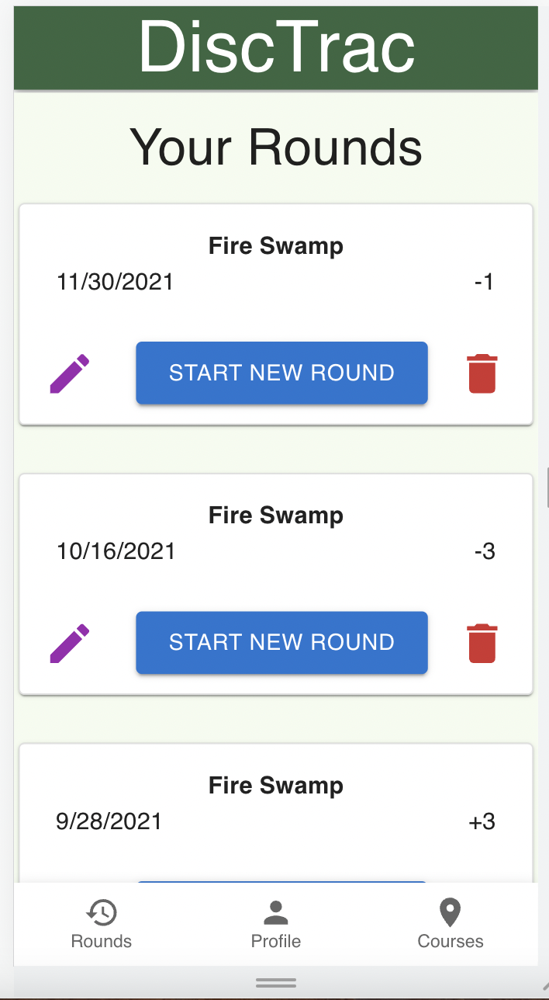
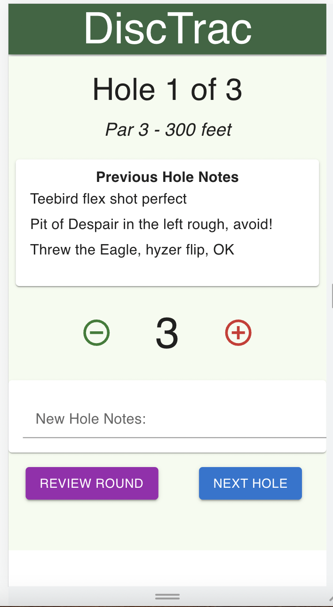
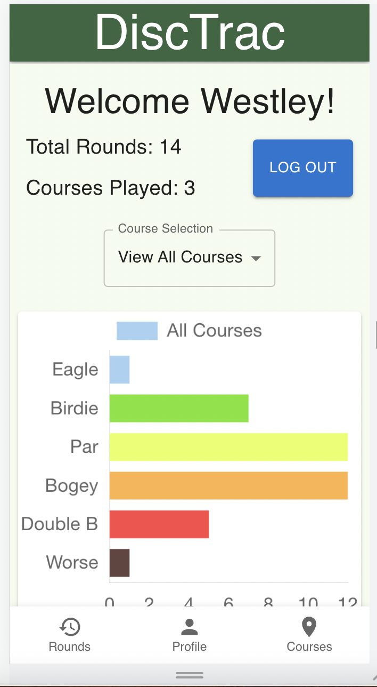

# DiscTrac Disc Golf Score and Note Tracker

## Table of Contents

- [Description](#description)
- [Screenshots](#screenshots)
- [Built With](#built-with)
- [Getting Started](#getting-started)
  - [Prerequisites](#prerequisites)
  - [Installation](#installation)
- [Usage](#usage)
- [License](#license)
- [Acknowledgements](#acknowledgements)
- [Contacts](#contacts)

## Description

2-week sprint solo project for Prime Digital Academy in Minneapolis, Minnesota.

Disc golf courses rarely come with scorecards, and there are so many discs and shots to try on any given hole. This app allows a user to record their scores and notes while they play a round. The app will retrieve notes from any prior rounds as the user plays the course again.

## Screenshots

Rounds View 

Hole Score View

Profile View

## Built With

## Getting Started

What do I need to do or know before attempting to use your project

### Prerequisites

[Node.js](https://nodejs.org/en/)

[Postgres](https://www.postgresql.org/)

[Nodemon](https://nodemon.io/)

[Chart.js](https://www.chartjs.org/)

[Material-UI](https://mui.com/)

### Installation

1. Create a database named 'disctrac-solo-project'(or change the name in the pool.js file, line 33).

2. The queries in the 'database.sql' file are set up to create all the necessary tables and populate them with initial data to allow the application to run properly. The project is built on [Postgres](https://www.postgresql.org/download/), so you will need to make sure to have that installed. We recommend using Postico to run those queries as that was used to create the queries.

3. Open up the project in your editor of choice, then run an 'npm install' command in your terminal.

4. Run 'npm run server' in your terminal to initialize the back-end.

5. Run 'npm run client' in your terminal. 

6. This command should automatically open a browser window showing the app at localhost:3000/#/. 

## Usage

1. Users can start a round either from the previous round cards, or from the courses view for any courses in the application.

2. Users can add new courses by clicking the Course Search button on the Courses View.

3. Users can view their round and hole score statistics on the Profile View.

## License

<a href="https://choosealicense.com/licenses/mit/">MIT License</a>

## Acknowledgements

Much thanks to Dane Smith, Liz Kerber, and the entire Prime Academy family for all of their instruction and assistance!  Special thanks to Tim Gostovic of Disc Golf Course Review for allowing me access to his development API with real course data from NY and Ontario.

## Contacts

  